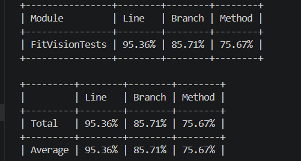

# ЗВІТ З ЛАБОРАТОРНОЇ РОБОТИ №3

Виконав: **Бондар Артем**

### 1. Тема та мета лабораторної роботи
**Тема:** МОДУЛЬНЕ ТЕСТУВАННЯ ПРОГРАМНОГО КОДУ.  
**Мета:** Набуття практичних навичок із написання модульних тестів із використанням промислових фреймворків тестування. Оволодіння формальними техніками проєктування тестів — еквівалентне розбиття (Equivalence Partitioning) та аналіз граничних значень (Boundary Value Analysis). Отримання досвіду інтерпретації метрик покриття коду (code coverage) та ітеративного поліпшення тестового набору до досягнення порогу покриття рядків не менше 80 %.

### 2. Вихідний код реалізованого модуля з коментарями
Для тестування було обрано модуль `FitVisionSystemManager`, який відповідає за бізнес-логіку (вимоги FR-07, FR-08). Код містить нетривіальну логіку (перевірки діапазонів, цикли `foreach`, роботу з інтерфейсами, викидання винятків) та є ізольованим від зовнішніх сервісів для модульного тестування.

* **Посилання на файл FitVisionSystemManager.cs:** [https://github.com/denyspotsebin/FitVision-AI/blob/main/ЛБ3/Bondar/FitVisionTests/FitVisionSystemManager.cs]
* **Посилання на діаграму класів з ЛБ№2:** [https://github.com/denyspotsebin/FitVision-AI/blob/main/Class-diagram/fr-07-08-cd-bondar.png]

### 3. Таблиця проєктування тестів

| ID | Тест-кейс (Що тестуємо) | Вхідні дані | Очікуваний результат | Техніка | Статус |
| :--- | :--- | :--- | :--- | :--- | :--- |
| **TC-01** | `ValidateData`: мінімально допустима вага | `Weight=20.0, BodyFat=15.0, Date=Today` | Повертає `true`, валідація успішна | BVA | Pass |
| **TC-02** | `ValidateData`: вага нижче допустимої | `Weight=19.9, BodyFat=15.0, Date=Today` | Викидає `ArgumentOutOfRangeException` | BVA | Pass |
| **TC-03** | `ValidateData`: максимально допустимий жир | `Weight=80.0, BodyFat=70.0, Date=Today` | Повертає `true`, валідація успішна | BVA | Pass |
| **TC-04** | `ValidateData`: жир вище допустимого | `Weight=80.0, BodyFat=70.1, Date=Today` | Викидає `ArgumentOutOfRangeException` | BVA | Pass |
| **TC-05** | `ValidateData`: дата запису з майбутнього | `Weight=80.0, BodyFat=15.0, Date=Tomorrow` | Викидає `ArgumentException` | EP | Pass |
| **TC-06** | `ProcessFitnessDataBatch`: null замість user | `user=null, newRecords=[1 valid]` | Викидає `ArgumentNullException` | EP | Pass |
| **TC-07** | `ProcessFitnessDataBatch`: порожній пакет | `user=User, newRecords=[]` | Викидає `ArgumentException` | BVA | Pass |
| **TC-08** | `ProcessFitnessDataBatch`: мікс записів | `user=User, newRecords=[1 valid, 1 invalid]`| Повертає `1` (кількість збережених) | EP | Pass |
| **TC-09** | `ProcessAnalysisAndNotify`: вимкнені сповіщення | `user.NotificationsEnabled=false` | Повертає об'єкт `Notification` (`IsSent=false`) | EP | Pass |
| **TC-10** | `ProcessAnalysisAndNotify`: успішний Push | `NotificationsEnabled=true, SendPush=true`| Повертає об'єкт `Notification` (`IsSent=true`) | EP | Pass |
| **TC-11** | `ProcessAnalysisAndNotify`: збій Push, успіх Email | `SendPush=false, SendEmail=true` | Повертає об'єкт `Notification` (`IsSent=true`) | EP | Pass |
| **TC-12** | `ProcessAnalysisAndNotify`: помилка сервісу | `user.Enabled=true, Service=Exception` | Повертає об'єкт `Notification` (`IsSent=false`) | EP | Pass |

### 4. Вихідний код тестового набору з коментарями
Тести написані з використанням фреймворку xUnit та бібліотеки Moq для імітації зовнішніх сервісів. Кожен тест суворо дотримується патерну AAA (Arrange — Act — Assert) та має коментарі із зазначенням використаної техніки (EP/BVA).
* **Посилання на файл FitVisionSystemTests.cs:** [https://github.com/denyspotsebin/FitVision-AI/blob/main/ЛБ3/Bondar/FitVisionTests/FitVisionSystemTests.cs]

### 5. Світлини звіту покриття коду (Line Coverage)
* Звіт покриття коду (фінальна ітерація, Line Coverage: 95.36%):  
  

### 6. Висновки
Під час виконання лабораторної роботи було успішно реалізовано модуль бізнес-логіки та покрито його 12 модульними тестами за допомогою xUnit та Moq. Завдяки детальному проєктуванню тест-кейсів за техніками еквівалентного розбиття та аналізу граничних значень, було досягнуто високого покриття коду (Line Coverage: **95.36%**), що перевищує необхідний поріг у 80%.

**Шляхи поліпшення (Ітеративний цикл):** 
Під час першої ітерації запуску тестів було виявлено падіння тесту TC-01 (перевірка мінімально допустимої ваги 20 кг). Аналіз показав наявність логічної помилки в коді бізнес-логіки: використання умови `Weight <= 20.0f` призводило до викидання винятку навіть для валідного граничного значення. В рамках ітеративного циклу код було виправлено на `Weight < 20.0f`. Друга ітерація тестування пройшла успішно — усі 12 тестів отримали статус Passed.
