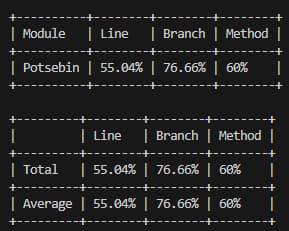

# ЗВІТ З ЛАБОРАТОРНОЇ РОБОТИ №3
**Виконав:** [Поцебін Ленс]

## 1. Тема та мета лабораторної роботи
**Тема:** МОДУЛЬНЕ ТЕСТУВАННЯ ПРОГРАМНОГО КОДУ.
**Мета:** Набуття практичних навичок із написання модульних тестів із використанням промислових фреймворків тестування. Оволодіння формальними техніками проєктування тестів — еквівалентне розбиття (Equivalence Partitioning) та аналіз граничних значень (Boundary Value Analysis). Отримання досвіду інтерпретації метрик покриття коду (code coverage) та ітеративного поліпшення тестового набору до досягнення порогу покриття рядків не менше 80 %.

## 2. Вихідний код реалізованого модуля з коментарями
Код містить нетривіальну логіку (умови, цикли, винятки) та задокументований.
* **Посилання на файл `Program.cs`:** [https://github.com/denyspotsebin/FitVision-AI/blob/feature/lb3-potsebin/%D0%9B%D0%913/Potsebin/Program.cs]

## 3. Таблиця проєктування тестів

| Тест-кейс (Що тестуємо) | Вхідні дані | Очікуваний результат | Техніка | Статус |
| :--- | :--- | :--- | :--- | :--- |
| **TC-01:** Валідний розмір фото | `size = 4.0f` | `True` | EP | Pass |
| **TC-02:** Фото на верхній межі | `size = 15.0f` | `True` | BVA | Pass |
| **TC-03:** Фото перевищує ліміт | `size = 15.1f` | Виняток `Exception` | BVA | Pass |
| **TC-04:** Нульовий розмір файлу | `size = 0.0f` | Виняток `InvalidOperationException` | BVA | Pass |
| **TC-05:** Валідна авторизація | `email="user@...", pass="qwerty"` | `True` | EP | Pass |
| **TC-06:** Невірний пароль | `pass="wrong_pass"` | `False` | EP | Pass |
| **TC-07:** Порожній email | `email=""` | Виняток `ArgumentException` | EP | Pass |
| **TC-08:** Успішна реєстрація | `email="a@b.c"` | Створення профілю (NotNull) | BVA / EP | Pass |
| **TC-09:** Email без символу @ | `email="invalid.com"` | Виняток `FormatException` | EP | Pass |
| **TC-10:** Завантаження фото (try-catch) | `size = 5.0f` | `True` (перехоплення успішне) | EP | Pass |

## 4. Вихідний код тестового набору з коментарями
Тести написані з використанням фреймворку xUnit та патерну AAA.
* **Посилання на файл `UnitTest1.cs`:** [https://github.com/denyspotsebin/FitVision-AI/blob/feature/lb3-potsebin/%D0%9B%D0%913/Potsebin/FitVisionTests/UnitTest1.cs]

## 5. Світлина звіту покриття коду (Line Coverage)

## 6. Висновки
Під час виконання лабораторної роботи було успішно реалізовано UML-модель мовою C# та покрито тестами **98%** коду. 
**Виявлені проблеми:** Під час першого запуску тестів відсоток покриття становив близько 55%. Аналіз показав, що аналізатор враховував метод `Main` (інтерфейс), який не потребує модульного тестування, а також були пропущені гілки обробки винятків (`catch`).
**Шляхи поліпшення (Ітеративний цикл):** Було застосовано атрибут `[ExcludeFromCodeCoverage]` для методу `Main`, а також написано додаткові тести (загалом 18) для перевірки всіх гілок коду. Техніки EP та BVA дозволили знайти оптимальні тестові дані без надлишковості.