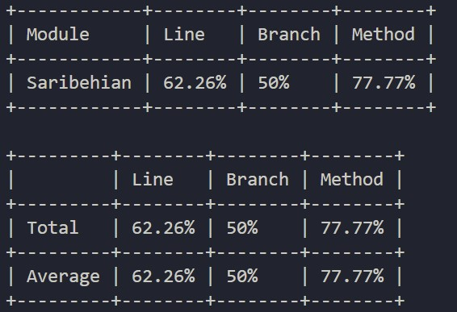
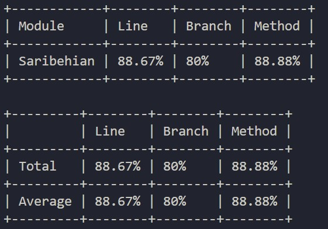

# ЗВІТ З ЛАБОРАТОРНОЇ РОБОТИ №3

Виконав: **[Сарібегян Арсен]**

### 1. Тема та мета лабораторної роботи
**Тема:** МОДУЛЬНЕ ТЕСТУВАННЯ ПРОГРАМНОГО КОДУ.  
**Мета:** Набуття практичних навичок із написання модульних тестів із використанням промислових фреймворків тестування. Оволодіння формальними техніками проєктування тестів — еквівалентне розбиття (Equivalence Partitioning) та аналіз граничних значень (Boundary Value Analysis). Отримання досвіду інтерпретації метрик покриття коду (code coverage) та ітеративного поліпшення тестового набору до досягнення порогу покриття рядків не менше 80 %.

### 2. Вихідний код реалізованого модуля з коментарями
Для тестування було обрано модуль `HistoryService`, який відповідає за бізнес-логіку (вимоги FR-05, FR-06). Код містить нетривіальну логіку (умови, цикли `foreach`, фільтрацію LINQ, викидання винятків) та є ізольованим від реальної БД для модульного тестування.
* **Посилання на файл HistoryService.cs:** [https://github.com/denyspotsebin/FitVision-AI/blob/main/ЛБ3/Saribehian/HistoryService.cs]
* **Посилання на діаграму класів з ЛБ№2:** [https://github.com/denyspotsebin/FitVision-AI/blob/main/Class-diagram/fr-05-06-cd-saribehian.png]

### 3. Таблиця проєктування тестів

| Тест-кейс (Що тестуємо) | Вхідні дані | Очікуваний результат | Техніка | Статус |
| :--- | :--- | :--- | :--- | :--- |
| **TC-01: Валідні дані збереження** | userId="user1", photo="url", result="ok" | True, запис додано | EP | Pass |
| **TC-02: Порожній userId** | userId="", photo="url", result="ok" | Виняток ArgumentException | EP | Pass |
| **TC-03: Отримання існуючої історії** | userId="user1", daysLimit=7 | Список із 1 запису | EP | Pass |
| **TC-04: Відсутність записів за період** | userId="user1", daysLimit=1 | Виняток InvalidOperationException | EP | Pass |
| **TC-05: Нульовий ліміт днів** | daysLimit=0 | Виняток ArgumentOutOfRangeException | BVA | Pass |
| **TC-06: Від'ємний ліміт днів** | daysLimit=-1 | Виняток ArgumentOutOfRangeException | BVA | Pass |
| **TC-07: Мінімально допустимий ліміт** | daysLimit=1 | Історія або виняток (залежно від БД) | BVA | Pass |
| **TC-08: Успішне очищення історії** | userId="user1" (наявні 2 записи) | Повертає 2 (кількість видалених) | EP | Pass |
| **TC-09: Очищення порожньої історії** | userId="user2" (порожньо) | Повертає 0 | EP | Pass |
| **TC-10: Null замість userId** | userId=null | Виняток ArgumentException | EP | Pass |

### 4. Вихідний код тестового набору з коментарями
Тести написані з використанням фреймворку xUnit. Кожен тест суворо дотримується патерну AAA (Arrange — Act — Assert) та має коментарі із зазначенням використаної техніки (EP/BVA).
* **Посилання на файл HistoryServiceTests.cs:** [https://github.com/denyspotsebin/FitVision-AI/blob/main/ЛБ3/Saribehian/FitVisionTests/HistoryServiceTests.cs]

### 5. Світлини звіту покриття коду (Line Coverage)
* Звіт покриття коду (перша спроба, 62.26%):  
  
* Звіт покриття коду (друга спроба, досягнення 88.67%):  
  

### 6. Висновки
Під час виконання лабораторної роботи було успішно реалізовано модуль бізнес-логіки та покрито його 10 модульними тестами за допомогою xUnit. 
**Виявлені проблеми:** Під час першого запуску тестів відсоток покриття становив 62.26%. Аналіз показав, що були пропущені гілки методів для очищення історії та деякі граничні значення дат.
**Шляхи поліпшення (Ітеративний цикл):** Було проведено аналіз непокритих ділянок та розширено набір тест-кейсів. Використання технік EP та BVA дозволило якісно закрити всі прогалини в логіці, що підвищило фінальне Line Coverage до **88.67%**. Усі 10 тестів успішно проходять перевірку (Passed).