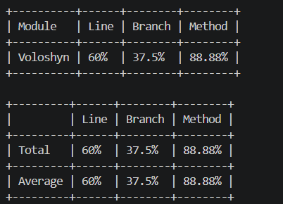
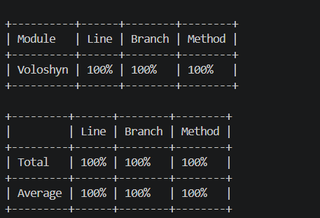
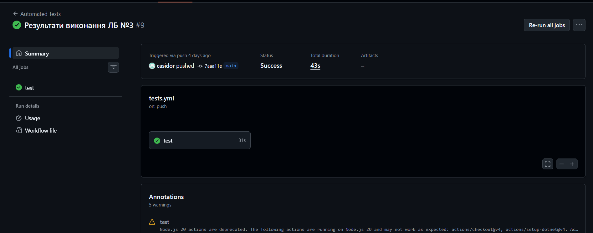

# ЗВІТ З ЛАБОРАТОРНОЇ РОБОТИ №3
**Виконав:** [Волошин Роман]

## 1. Тема та мета лабораторної роботи
**Тема:** МОДУЛЬНЕ ТЕСТУВАННЯ ПРОГРАМНОГО КОДУ.
**Мета:** Набуття практичних навичок із написання модульних тестів із використанням промислових фреймворків тестування. Оволодіння формальними техніками проєктування тестів — еквівалентне розбиття (Equivalence Partitioning) та аналіз граничних значень (Boundary Value Analysis). Отримання досвіду інтерпретації метрик покриття коду (code coverage) та ітеративного поліпшення тестового набору до досягнення порогу покриття рядків не менше 80 %.

## 2. Вихідний код реалізованого модуля з коментарями
Код містить нетривіальну логіку (умови, цикли, винятки) та задокументований.
* **Посилання на файл `Program.cs`:** [https://github.com/denyspotsebin/FitVision-AI/blob/lab3-voloshyn/%D0%9B%D0%913/Voloshyn/Program.cs]
* **Посилання на діаграму класів з ЛБ№2:** [https://github.com/denyspotsebin/FitVision-AI/blob/lab3-voloshyn/Class-diagram/fr-03-04-cd-voloshyn.png]

## 3. Таблиця проєктування тестів

| Тест-кейс (Що тестуємо) | Вхідні дані | Очікуваний результат | Техніка | Статус |
| :--- | :--- | :--- | :--- | :--- |
| **TC-01:** Вага нижче нижньої межі | `DesiredWeight = 30.0f` | Виняток `ArgumentOutOfRangeException` | BVA | Pass |
| **TC-02:** Вага на нижній межі (валідна) | `DesiredWeight = 30.1f` | `True` | BVA | Pass |
| **TC-03:** Вага на верхній межі | `DesiredWeight = 250.0f` | `True` | BVA | Pass |
| **TC-04:** Вага вище верхньої межі | `DesiredWeight = 250.1f` | Виняток `ArgumentOutOfRangeException` | BVA | Pass |
| **TC-05:** Жир нижче нижньої межі | `BodyFatPercentage = 2.9f` | Виняток `ArgumentOutOfRangeException` | BVA | Pass |
| **TC-06:** Жир вище верхньої межі | `BodyFatPercentage = 50.1f` | Виняток `ArgumentOutOfRangeException` | BVA | Pass |
| **TC-07:** Валідні середні значення | `Weight = 70.0f`, `Fat = 15.0f` | `True` | EP | Pass |
| **TC-08:** Некоректний ID користувача | `userId = 0` | Виняток `ArgumentException` | BVA | Pass |
| **TC-09:** Ліміт запитів не вичерпано | `UsedRequests = 4` | `True` | EP | Pass |
| **TC-10:** Ліміт запитів вичерпано | `UsedRequests = 5` | Виняток `InvalidOperationException` | BVA | Pass |
| **TC-11:** Фото відсутнє (null) | `photo = null` | Виняток `ArgumentNullException` | EP | Pass |
| **TC-12:** Погана якість фото | `IsQualityGood = false` | Виняток `ArgumentException` | EP | Pass |
| **TC-13:** Успішна генерація | `IsQualityGood = true` | Повертається ім'я файлу | EP | Pass |

## 4. Вихідний код тестового набору з коментарями
Тести написані з використанням фреймворку xUnit та патерну AAA.
* **Посилання на файл `UnitTest1.cs`:** [https://github.com/denyspotsebin/FitVision-AI/blob/lab3-voloshyn/%D0%9B%D0%913/Voloshyn/FitVisionTests/FitVisionServicesTests.cs]

## 5. Світлин звіту покриття коду (Line Coverage)

* Звіт покриття коду перша спроба, досягнення 60% покритя

* Звіт покриття коду друга спроба, досягнення 100% покритя

## 6. Виконання додаткового завдання (Бонус)
**Завдання:** Налаштувати автоматичний запуск тестів через GitHub Actions.

Для автоматизації тестування проєкту було впроваджено CI/CD workflow. Оскільки в межах командного репозиторію різні модулі використовують різні версії платформи (мій код — **.NET 10**, код одногрупника — **.NET 8**), мною було реалізовано специфічну конфігурацію оточення.

### Реалізовані кроки:
1. **Створення Workflow:** У директорії `.github/workflows/` оновлено файл `tests.yml`, що описує кроки збірки та тестування.
2. **Налаштування Multi-SDK:** Використано параметр `dotnet-version` для одночасного встановлення обох версій SDK (8.0.x та 10.0.x). Це дозволяє GitHub Actions коректно збирати проєкти з різними цільовими фреймворками в одному циклі.
3. **Автоматизація запусків:** Додано окрему команду для запуску тестів мого модуля:
   `run: dotnet test "ЛБ3/Voloshyn/FitVisionTests/FitVisionTests.csproj"`.
* **Світлина успішного проходження автоматичних тестів на сервері GitHub:**
  

### Результат:
Тепер при кожному `push` або `pull request` GitHub автоматично запускає віртуальну машину (Ubuntu), розгортає необхідні версії .NET та проводить повне тестування. Успішне проходження тестів підтверджується «зеленою галочкою» (Status Check) в інтерфейсі GitHub, що гарантує цілісність коду перед його злиттям з основною гілкою.
# Висновки

У результаті виконання лабораторної роботи було розроблено та протестовано за допомогою xUnit модулі бізнес-логіки `TargetParameters` та `AIGeneratorService` на мові C#. Для перевірки працездатності системи було реалізовано **13 модульних тестів** на базі фреймворку xUnit.

**Аналіз результатів та виявлені проблеми:**
* Під час первинного тестування було виявлено недостатнє покриття коду: показник ліній становив **60%**, а розгалужень (гілок) — лише **37.5%**.
* Основною проблемою було те, що тести не охоплювали логіку валідації вхідних даних (зокрема граничні стани ваги та відсотка жиру) та сценарії з викиданням виняткових ситуацій при вичерпанні лімітів запитів.

**Процес покращення:**
* Для усунення «білих плям» у логіці було проведено ітеративне доопрацювання тестового набору.
* Завдяки застосуванню технік **EP** (еквівалентний поділ) та **BVA** (аналіз граничних значень) вдалося сформувати оптимальну кількість тестів, що покривають усі можливі стани системи.

**Фінальний підсумок:**
Усі 13 розроблених тестів успішно пройшли перевірку, що дозволило підвищити фінальні показники покриття (Line, Branch та Method Coverage) до **100%**. Це підтверджує високу надійність реалізованого коду та його готовність до коректної обробки як валідних, так і помилкових даних.