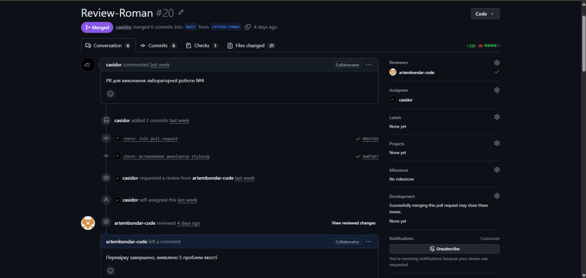
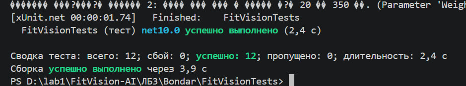
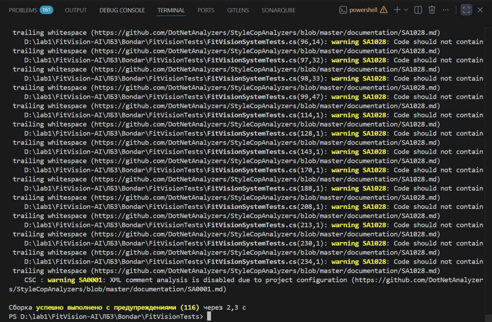
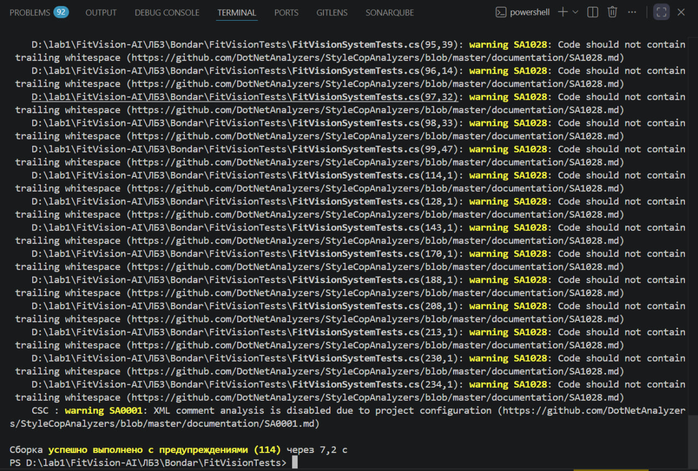
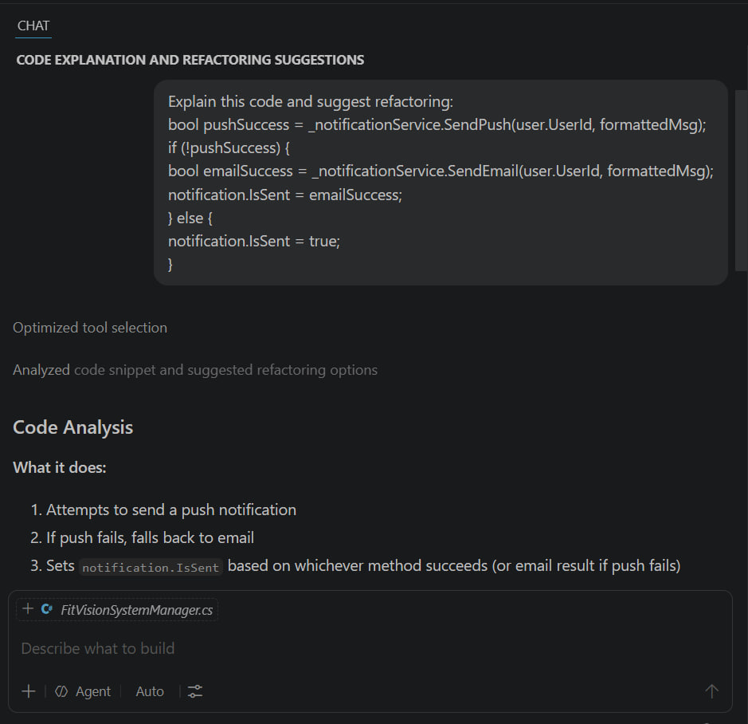
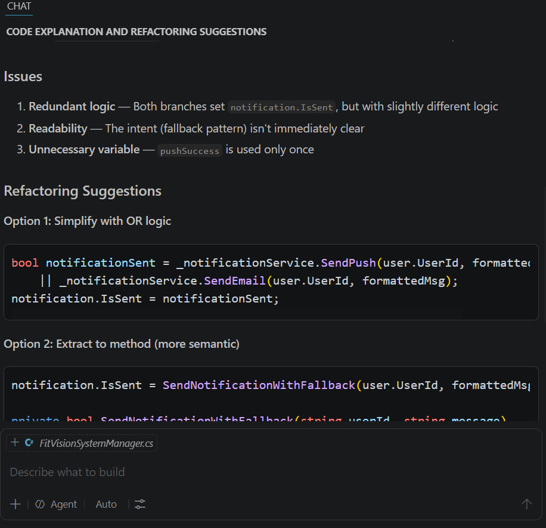
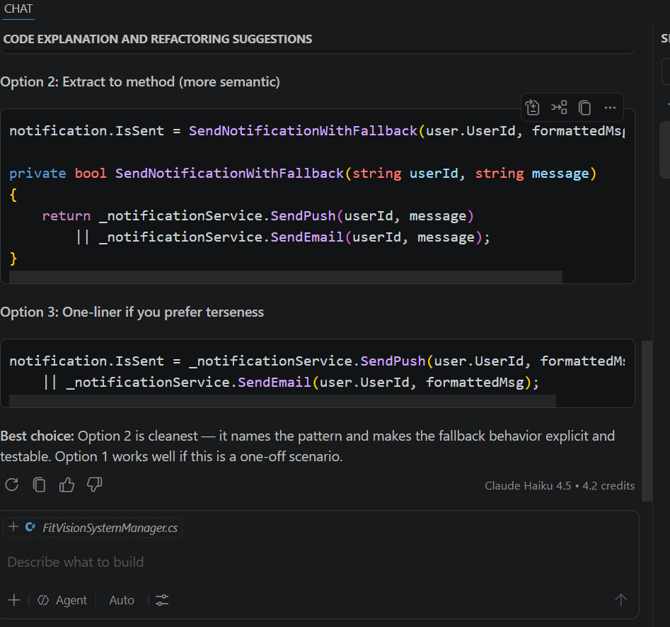

# ЗВІТ З ЛАБОРАТОРНОЇ РОБОТИ №4
**Виконав:** [Бондар Артем]

## 1. Тема та мета лабораторної роботи
**Тема:** Статичний аналіз коду, Code Review та рефакторинг.
**Мета:** Опанувати інструменти статичного аналізу (лінтери), навчитися проводити взаємний огляд коду (Code Review) для виявлення code smells, а також виконати рефакторинг власного коду з подальшим регресійним тестуванням.

## 2. Результати Code Review одногрупника
Під час перевірки файлу `Services.cs` одногрупника було виявлено наступні проблеми якості коду:

| № | Рядок коду | Проблема | Категорія | Рекомендація |
| :--- | :--- | :--- | :--- | :--- |
| 1 | 13-18 | `30`, `250`, `3`, `50` | Magic Numbers | Винести числові межі у константи класу (напр., `MIN_WEIGHT`). |
| 2 | 3-50 | Кілька класів в одному файлі | Multiple Classes in One File | Кожен клас (`TargetParameters`, `BasePhoto`, `AIGeneratorService`) має бути у власному файлі. |
| 3 | 29-30 | Використання `throw` для валідації | Exceptions for Control Flow | Змінити методи валідації на такі, що повертають `bool`, щоб не перевантажувати стек викликів винятками. |
| 4 | 43 | `public int UsedRequests { get; set; }` | Broken Encapsulation | Змінити сеттер на `private` (`{ get; private set; }`), щоб обмежити доступ до ліміту. |
| 5 | 73 | `"Погана якість фото..."` | Magic Strings | Винести текстові повідомлення про помилки у константи або файл ресурсів. |



## 3. Посилання на власний код програми (ЛБ3)
**Код до та після рефакторингу:** [(https://github.com/denyspotsebin/FitVision-AI/blob/main/%D0%9B%D0%913/Bondar/FitVisionTests/FitVisionSystemManager.cs)]

## 4. Посилання на Pull Request з коментарями Code Review
**PR із моїми inline-коментарями:** [(https://github.com/denyspotsebin/FitVision-AI/pull/20)]

## 5. Результати рефакторингу власного коду

### Операція 1: Усунення Magic Numbers (Винесення меж ваги)

**БУЛО:**
```csharp
if (Weight < 20.0f || Weight > 350.0f)
    throw new ArgumentOutOfRangeException(nameof(Weight), "Вага має бути в межах від 20 до 350 кг.");
```

**СТАЛО:**
```csharp
public const float MinWeight = 20.0f;
public const float MaxWeight = 350.0f;

// ...

if (Weight < MinWeight || Weight > MaxWeight)
    throw new ArgumentOutOfRangeException(nameof(Weight), $"Вага має бути в межах від {MinWeight} до {MaxWeight} кг.");
```

**ЧОМУ:** Винесення жорстко закодованих значень у константи класу робить код самодокументованим і усуває дублювання значень у логіці перевірки та текстах помилок. Це значно спрощує підтримку та можливу зміну лімітів у майбутньому.

### Операція 2: Усунення Hardcoded Dependency (Генерація ідентифікатора)

**БУЛО:**
```csharp
var notification = new Notification
{
    NotificationId = new Random().Next(1, 10000),
    Message = analysisResultMsg,
    IsSent = false
};
```

**СТАЛО:**
```csharp
var notification = new Notification
{
    NotificationId = Math.Abs(Guid.NewGuid().GetHashCode()),
    Message = analysisResultMsg,
    IsSent = false
};
```

**ЧОМУ:** Використання `Random().Next()` зі штучним лімітом `10000` створювало високий ризик колізій ідентифікаторів. Заміна на використання `Guid` забезпечує надійну генерацію унікальних ID без жорсткої прив'язки до обмеженого магічного діапазону.

### Операція 3: Усунення Unnecessary Else (Спрощення маршрутизації)

**БУЛО:**
```csharp
bool pushSuccess = _notificationService.SendPush(user.UserId, formattedMsg);
if (!pushSuccess)
{
    bool emailSuccess = _notificationService.SendEmail(user.UserId, formattedMsg);
    notification.IsSent = emailSuccess;
}
else
{
    notification.IsSent = true;
}
```

**СТАЛО:**
```csharp
bool pushSuccess = _notificationService.SendPush(user.UserId, formattedMsg);

if (pushSuccess)
{
    notification.IsSent = true;
    return notification;
}

notification.IsSent = _notificationService.SendEmail(user.UserId, formattedMsg);
return notification;
```

**ЧОМУ:** Видалення зайвого блоку `else` за допомогою техніки раннього повернення (Guard Clause) зменшує рівень вкладеності коду. Це робить логіку виконання лінійною, більш передбачуваною та значно легшою для читання.

## 6. Звіт регресійного тестування та метрики

Після проведення рефакторингу всі існуючі тести успішно пройшли перевірку, що підтверджує відсутність зламів у бізнес-логіці.

* **Результати тестів (xUnit):** Усі 12 тестів Passed.
* **Результати лінтера (StyleCop):** Попередження стилістичного характеру (116 до рефакторингу та 114 після).
* **Аналіз складності:** Цикломатична складність методу `ProcessAnalysisAndNotify` знизилася з 4 до 3 завдяки спрощенню умов та застосуванню Guard Clauses.



**Звіт лінтера StyleCop ДО**



**Звіт лінтера StyleCop ПІСЛЯ**



## 7. Підсумкова рефлексія

Практика проведення Code Review стала для мене вкрай цінним етапом навчання. Аналіз чужих програмних рішень дав змогу об'єктивно поглянути на поширені архітектурні недоліки. Найпоказовішим для мене стало виявлення проблем із порушенням принципу єдиної відповідальності (SRP), де бізнес-правила перепліталися з елементами інтерфейсу, а також наявність надмірно розгалужених умовних конструкцій. Цей процес спонукав мене більш вимогливо підходити до власної розробки. Відтепер я приділятиму значно більше уваги тому, щоб мій код був модульним, зрозумілим без зайвих коментарів (самодокументованим) та зручним для підтримки іншими членами команди.

## 8. Бонусне завдання: Аналіз коду за допомогою ШІ-асистента

Для виконання бонусного завдання я звернувся до ШІ-асистента (Windsurf/Claude) з проханням проаналізувати фрагмент методу `ProcessAnalysisAndNotify` та запропонувати шляхи його рефакторингу для підвищення якості коду.

**Мій запит (Prompt):**
> *Explain this code and suggest refactoring:* 
> `bool pushSuccess = _notificationService.SendPush(user.UserId, formattedMsg); if (!pushSuccess) { bool emailSuccess = _notificationService.SendEmail(user.UserId, formattedMsg); notification.IsSent = emailSuccess; } else { notification.IsSent = true; }`

**Аналіз від ШІ:**
Асистент провів аналіз коду та виділив такі проблеми:
* **Надлишковість логіки:** обидві гілки `if/else` встановлюють значення `notification.IsSent`, але реалізовані різними шляхами.
* **Читабельність:** намір коду (реалізація патерну "fallback") не був достатньо чітким.
* **Непотрібна змінна:** змінна `pushSuccess` використовувалася лише один раз.

**Запропоновані варіанти рефакторингу:**
ШІ надав три шляхи оптимізації:
1. **Спрощення через логіку OR (`||`):** використання оператора "або" для запису ланцюжка відправок.
2. **Винесення в окремий метод (рекомендовано):** створення семантично зрозумілого методу `SendNotificationWithFallback`.
3. **One-liner:** компактний запис логіки в один рядок.





**Висновок:**
Найкращим варіантом, згідно з порадою ШІ, визнано **Option 2**, оскільки він найкраще іменує патерн, робить поведінку системи явною та зручною для модульного тестування. Я успішно використав ці рекомендації для покращення архітектури свого модуля.
