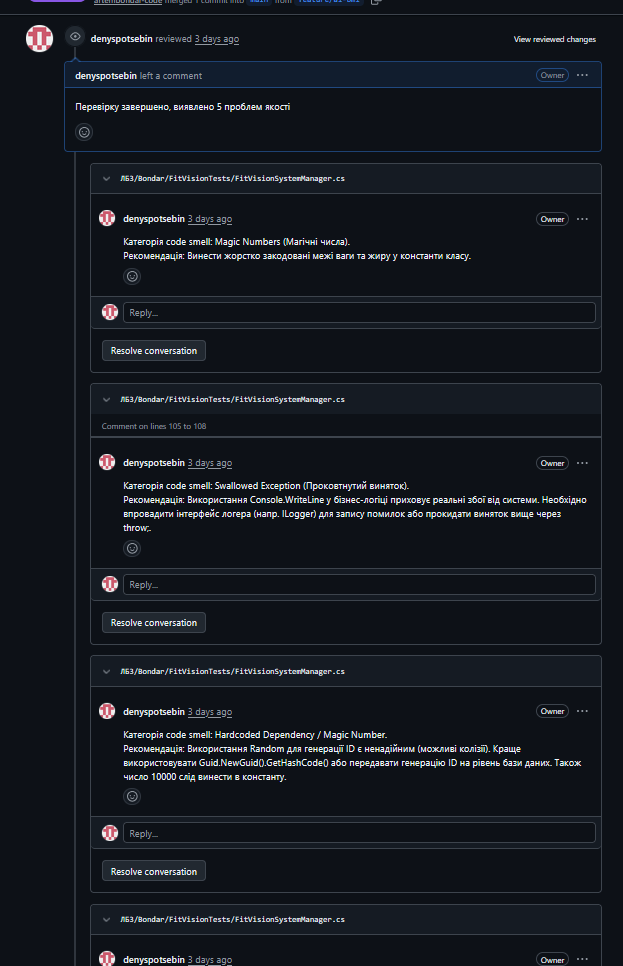
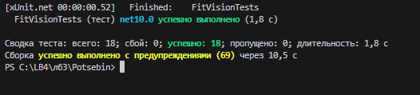
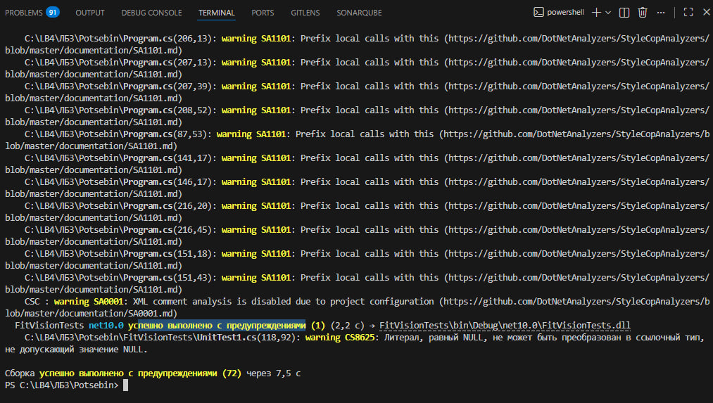
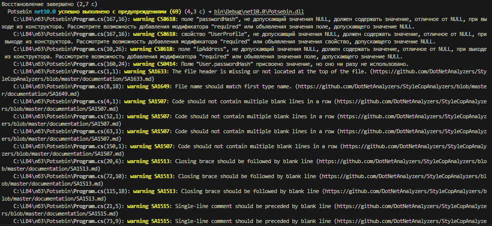

# ЗВІТ З ЛАБОРАТОРНОЇ РОБОТИ №4
**Виконав:** [Поцебін Денис]

## 1. Тема та мета лабораторної роботи
**Тема:** Статичний аналіз коду, Code Review та рефакторинг.
**Мета:** Опанувати інструменти статичного аналізу (лінтери), навчитися проводити взаємний огляд коду (Code Review) для виявлення code smells, а також виконати рефакторинг власного коду з подальшим регресійним тестуванням.

## 2. Результати Code Review одногрупника
Під час перевірки файлу `FitVisionSystemManager.cs` одногрупника було виявлено наступні проблеми якості коду:

| № | Рядок коду | Проблема | Категорія | Рекомендація |
| :--- | :--- | :--- | :--- | :--- |
| 1 | 46-50 | `if (Weight < 20.0f...` | Magic Numbers | Винести жорстко закодовані межі ваги та жиру у константи класу (напр., `MinWeight`). |
| 2 | 85-88 | `catch (Exception ex)` | Swallowed Exception | Замість виводу в консоль впровадити логер (`ILogger`) або прокидати виняток вище. |
| 3 | 100 | `new Random().Next` | Hardcoded Dependency | Використати `Guid.NewGuid()` для генерації унікального ID, щоб уникнути колізій. |
| 4 | 23 | `UpdateProfile() { }` | Dead Code | Порожні методи слід видалити (YAGNI) або додати `throw new NotImplementedException()`. |
| 5 | 112-121 | `if (!pushSuccess)` | Unnecessary Else | Спростити логіку маршрутизації, використовуючи Guard Clauses та пряме присвоєння. |



## 3. Посилання на власний код програми (ЛБ3)
**Код до та після рефакторингу:** [(https://github.com/denyspotsebin/FitVision-AI/blob/feature/lb4/potsebin/%D0%9B%D0%913/Potsebin/Program.cs)]

## 4. Посилання на Pull Request з коментарями Code Review
**PR із моїми inline-коментарями:** [(https://github.com/denyspotsebin/FitVision-AI/pull/18)]

## 5. Результати рефакторингу власного коду

### Операція 1: Усунення Inefficient Code (Заміна ручного циклу)

**БУЛО:**
```csharp
bool hasAtSymbol = false; bool hasDot = false;
foreach (char c in email) {
    if (c == '@') hasAtSymbol = true;
    if (c == '.') hasDot = true;
}
if (!hasAtSymbol || !hasDot)
```
**СТАЛО:**
```csharp
if (!email.Contains('@') || !email.Contains('.'))
```
**ЧОМУ:** Ручний цикл неефективний і збільшує складність коду. Використання вбудованого методу Contains робить код коротшим, безпечнішим і легшим для розуміння.

### Операція 2: Усунення порушення SRP (Видалення Console.WriteLine)

**БУЛО:**
```csharp
Console.WriteLine("[AuthService] Спроба авторизації...");
if (email == "user@fitvision.com" && pass == "qwerty") {
    Console.WriteLine("[AuthService] Успіх: Авторизація пройдена.");
    return true;
}
```
**СТАЛО:**
```csharp
if (email == "user@fitvision.com" && pass == "qwerty") {
    return true;
}
```
**ЧОМУ:** Класи бізнес-логіки не повинні відповідати за виведення повідомлень на екран (UI). Видалення цих викликів усуває порушення принципу єдиної відповідальності (SRP).

### Операція 3: Усунення Magic Numbers

**БУЛО:**
```csharp
if (fileSize > 15.0f)
    throw new Exception("Файл занадто великий. Обмеження: 15 МБ.");
```
**СТАЛО:**
```csharp
private const float MaxFileSizeMb = 15.0f; // Оголошено на рівні класу

if (fileSize > MaxFileSizeMb)
    throw new Exception($"Файл занадто великий. Обмеження: {MaxFileSizeMb} МБ.");
```
**ЧОМУ:** Жорстко закодовані числа ускладнюють підтримку коду. Винесення числа у константу полегшує його зміну в майбутньому (достатньо оновити значення лише в одному місці).

## 6. Звіт регресійного тестування та метрики

Після проведення рефакторингу всі існуючі тести успішно пройшли перевірку, що підтверджує відсутність зламів у бізнес-логіці.

* **Результати тестів (xUnit):** Усі 18 тестів Passed.
* **Результати лінтера (StyleCop):** Попередження стилістичного характеру (до та після рефакторингу).
* **Аналіз складності:** Цикломатична складність методу `Register` знизилася з 4 до 2 завдяки спрощенню умов.


**Звіт лінтера StyleCop ДО**

**Звіт лінтера StyleCop ПІСЛЯ**


## 7. Підсумкова рефлексія

Досвід проведення Code Review виявився надзвичайно корисним, адже читання чужого коду дозволяє поглянути на типові помилки збоку. Найбільше запам'яталося виявлення порушень принципу SRP (коли бізнес-логіка змішується з UI) та масивних блоків умов. Це навчило мене критичніше ставитися до власного коду, намагаючись робити його максимально модульним, самодокументованим та простим для розуміння іншими розробниками.

## 8. Бонусне завдання: Аналіз коду за допомогою GitHub Copilot Chat

Під час виконання рефакторингу я використав AI-асистента для пошуку кращого рішення оптимізації методу `Register`.

**Мій запит (Prompt):** *Explain this code and suggest refactoring: `bool hasAtSymbol = false; bool hasDot = false; foreach (char c in email) { ... } if (!hasAtSymbol || !hasDot) throw new FormatException();`*

**Відповідь ШІ:**
> Цей фрагмент перевіряє наявність символів '@' та '.' за допомогою ручного циклу. Це працює, але є надлишковим. C# має оптимізовані методи рядків. Рекомендується використати метод `Contains`. Це зменшить цикломатичну складність і покращить читабельність.
> 
> 
> Запропонований код: 
> `if (!email.Contains('@') || !email.Contains('.')) { throw new FormatException("..."); }`
