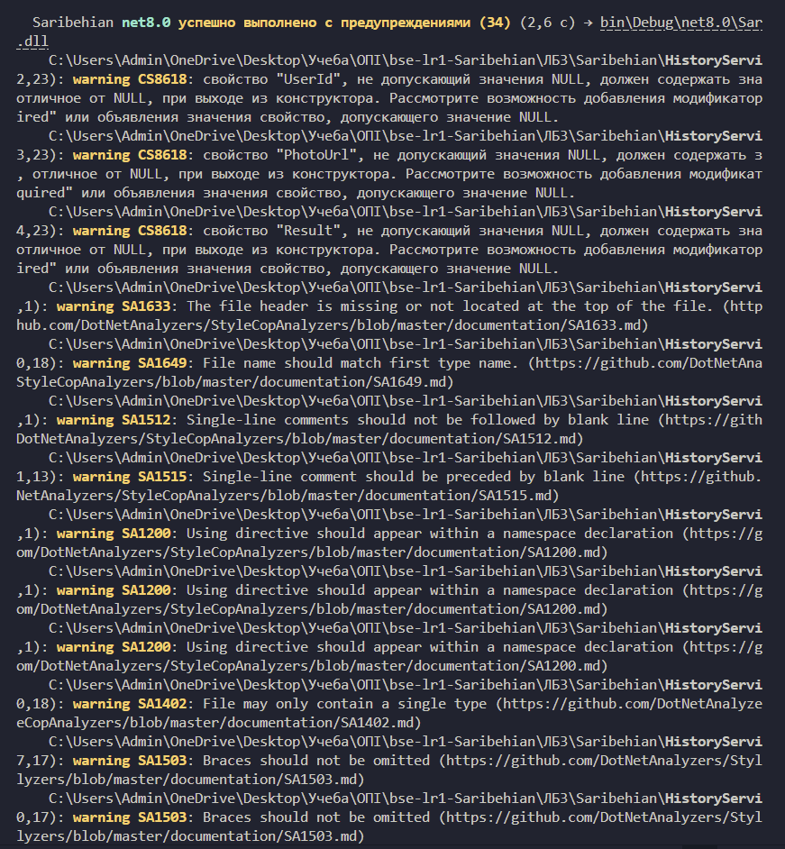
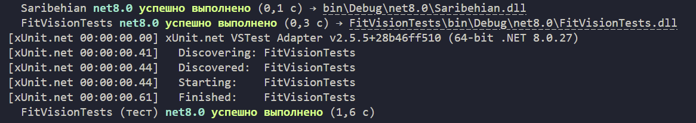
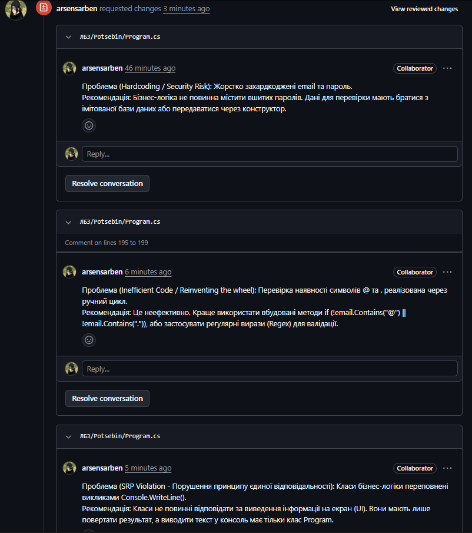
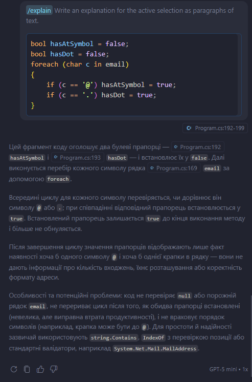

# Звіт з лабораторної роботи №4
**Тема:** РЕФАКТОРИНГ КОДУ ТА ПРОВЕДЕННЯ CODE REVIEW ЗА ІНДУСТРІАЛЬНИМИ СТАНДАРТАМИ
**Студент:** Сарібегян Арсен
**Група:** ПЗПІ-25-1

## 1. Статичний аналіз коду (StyleCop)
У рамках роботи до проєкту було підключено аналізатор коду `StyleCop.Analyzers`. Після налаштування правил та запуску збірки проєкту аналізатор виявив **34 попередження** щодо порушення стандартів кодування (Code Smells). 



## 2. Інспектування мого коду (Code Review від ревізора)
Мій Pull Request був перевірений ревізором. У ході Code Review він виявив наступні проблеми:
1. **Misleading Return Type:** Метод збереження завжди повертав `true`.
2. **DRY Violation:** Дублювання перевірки `string.IsNullOrWhiteSpace` у трьох методах.
3. **Exceptions for Control Flow:** Використання винятків для штатної ситуації (відсутність історії користувача).
4. **Inefficient Code:** Використання неефективного циклу `foreach` для видалення елементів.
5. **Noise Comments:** Наявність зайвих коментарів, що дублюють назви методів.

## 3. Рефакторинг
Усі зауваження ревізора були успішно виправлені:
* Тип повернення методу `SaveTransformation` змінено з `bool` на `void`.
* Перевірку ідентифікатора винесено в окремий приватний метод `ValidateUserId(string userId)`.
* Замість викидання `InvalidOperationException` метод `GetUserHistory` тепер коректно повертає порожній список.
* Цикл `foreach` у методі `ClearUserHistory` замінено на оптимізований вбудований метод `_database.RemoveAll(...)`.
* Код очищено від шумових коментарів.

## 4. Регресійне тестування
Оскільки логіка методів змінилася (прибрано винятки та змінено типи повернення), старі модульні тести впали. Тести були адаптовані під новий відрефакторений код. Після запуску `dotnet test` усі тести успішно пройдено, що підтверджує: рефакторинг не зламав працездатність програми.



## 5. Проведення Code Review (моя роль як ревізора)
Я виступив у ролі ревізора для коду напарника. Перевірку було проведено через функціонал GitHub Pull Requests. Було виявлено та задокументовано 5 "запахів коду", серед яких:
1. **Hardcoding / Security Risk:** Жорстко вшиті email та пароль у бізнес-логіку.
2. **Inefficient Code:** Використання ручного циклу для валідації пошти замість вбудованих методів.
3. **SRP Violation:** Виклики `Console.WriteLine()` прямо в класах бізнес-логіки.
4. **Magic Numbers:** Використання неочевидного числа `15.0f` в умові.
5. **Encapsulation Violation:** Публічний сеттер для списку фотографій.

Рев'ю було відправлено зі статусом "Request changes".



## 6. Бонусне завдання: Аналіз коду за допомогою GitHub Copilot Chat
Під час інспектування коду напарника я натрапив на підозрілий фрагмент ручної валідації email. Я використав штучний інтелект GitHub Copilot Chat (команда `/explain`) для аналізу цього фрагмента.

**Підозрілий код:**
```csharp
bool hasAtSymbol = false;
bool hasDot = false;
foreach (char c in email) { ... }
```

**Відповідь Copilot:** Штучний інтелект детально розібрав логіку роботи циклу і вказав на кілька суттєвих недоліків:
* Код не перевіряє `null` або порожній рядок.
* Цикл не переривається після того, як обидва прапорці встановлені (що призводить до втрати продуктивності).
* Код не враховує порядок символів (крапка може бути перед символом `@`).

Для покращення коду Copilot запропонував використати сучасні та надійні підходи: вбудовані методи `string.Contains`, `IndexOf` або спеціалізований клас `System.Net.Mail.MailAddress`. Це повністю підтвердило моє власне зауваження щодо неефективності ручного циклу (Проблема 2 у моєму рев'ю).



**Висновок:** Під час виконання лабораторної роботи я на практиці застосував інструменти статичного аналізу коду, провів рефакторинг за зауваженнями ревізора, переконався в надійності змін за допомогою регресійного тестування та успішно виконав роль ревізора, провівши Code Review коду напарника. Додатково було випробувано AI-асистента для рефакторингу коду.