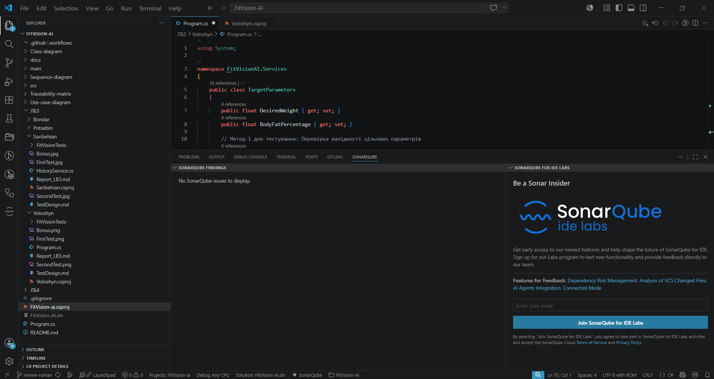
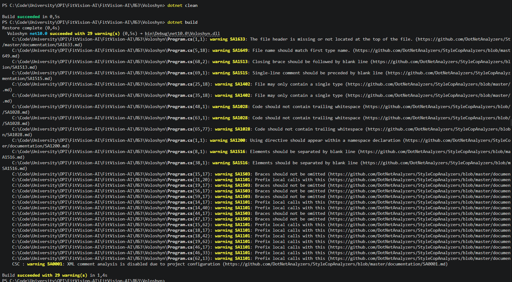
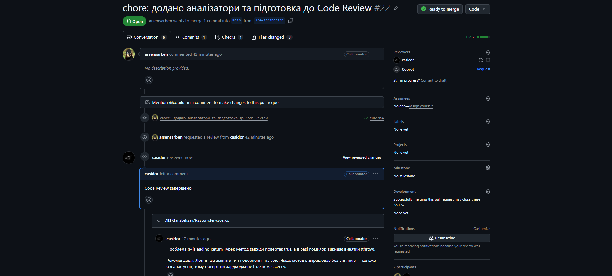
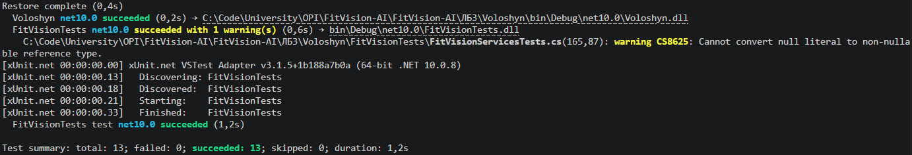
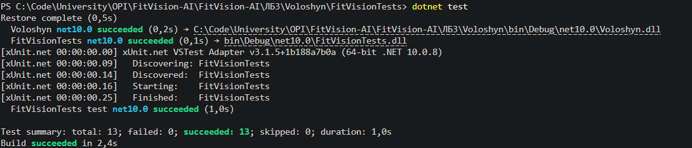
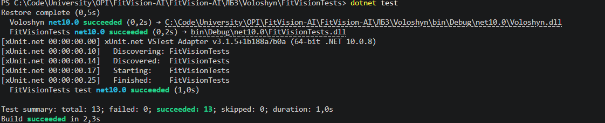
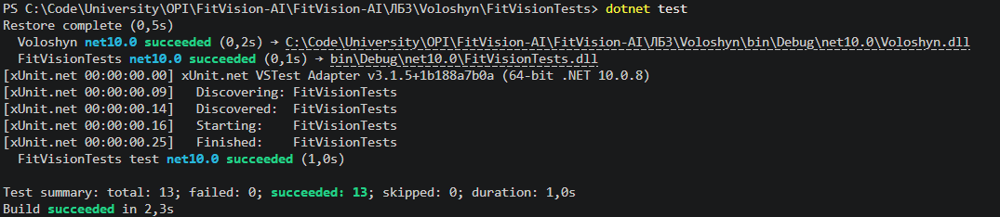
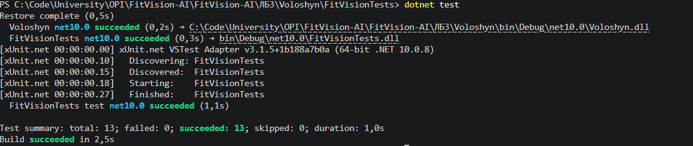
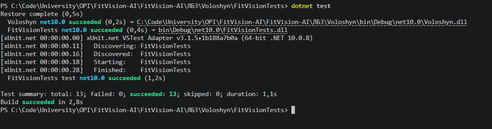
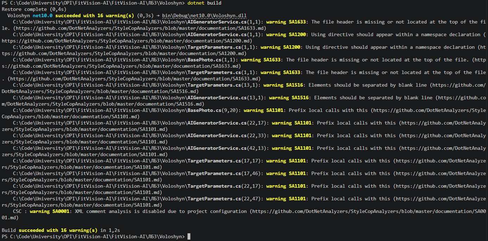

# ЗВІТ З ЛАБОРАТОРНОЇ РОБОТИ №4
**Виконав:** Волошин Роман, ПЗПІ 25-1

## 1. Тема та мета лабораторної роботи
**Тема:** РЕФАКТОРИНГ КОДУ ТА ПРОВЕДЕННЯ CODE REVIEW ЗА ІНДУСТРІАЛЬНИМИ СТАНДАРТАМИ.  
**Мета:** Набуття практичних навичок із проведення Code Review за індустріальними стандартами з використанням GitHub Pull Requests. Оволодіння методами ідентифікації та класифікації типових проблем якості коду (code smells). Отримання досвіду застосування рефакторинг-операцій із верифікацією збереження поведінки через регресійне тестування.

---

## 2. Підготовка

Робота виконується у команді з 4 студентів у спільному репозиторії. Code Review проводиться ланцюжком: кожен перевіряє код наступного учасника команди.

**Посилання на спільний репозиторій:** [https://github.com/denyspotsebin/FitVision-AI]

SonarQube for IDE (SonarLint) було встановлено та запущено, однак issues виявлено не було.

*Скріншот SonarLint — відсутність issues:*


Тому статичний аналіз виконано засобами StyleCop Analyzers. Зафіксовано початкову кількість warnings до рефакторингу.

*StyleCop warnings до рефакторингу:*


Початкова кількість StyleCop warnings: **29**

---

## 3. Code Review коду одногрупника

Проведено Code Review коду наступного учасника команди (Арсена) у спільному репозиторії через Pull Request.

**Посилання на PR з коментарями Code Review:** [https://github.com/denyspotsebin/FitVision-AI/pull/22]

*Відкритий PR з inline-коментарями Code Review:*


| № | Рядок коду | Проблема | Категорія | Рекомендація |
| :--- | :--- | :--- | :--- | :--- |
| 1 | `24` | Метод завжди повертає `true`, а в разі помилок викидає винятки (`throw`). | Misleading Return Type | Логічніше змінити тип повернення на `void`. Якщо метод відпрацював без винятків — це вже означає успіх, тому повертати хардкоджене `true` немає сенсу. |
| 2 | `48` | Перевірка `string.IsNullOrWhiteSpace(userId)` дублюється у трьох різних методах. | DRY Violation | Варто винести цю перевірку в окремий приватний допоміжний метод (наприклад, `ValidateUserId`), щоб уникнути дублювання коду. |
| 3 | `63-64` | Якщо історія порожня, викидається `InvalidOperationException`. | Exceptions for Control Flow | Відсутність історії у нового користувача — це нормальна бізнес-ситуація. Метод має просто повертати порожній список (`return userHistory;`), а клієнтський код вже сам вирішить, як це обробити. |
| 4 | `82-86` | Використання циклу `foreach` для видалення елементів зі списку з ручним підрахунком — це неефективний підхід. | Inefficient Code | Замість циклу краще використати вбудований метод `_database.RemoveAll(r => r.UserId == userId)`. Він працює швидше і відразу повертає кількість видалених елементів. |
| 5 | `23` | Коментарі на кшталт `// Метод 1: Збереження результату` дублюють інформацію. | Noise Comments | Згідно з Clean Code, імена методів (`SaveTransformation`, `GetUserHistory`) вже є самодокументованими. Такі коментарі створюють візуальний шум, їх краще видалити. |

---

## 4. Рефакторинг власного коду

Рефакторинг виконано за результатами отриманого Code Review від іншого учасника команди (Артема). 

* **Посилання на власний PR з рефакторингом:** [Pull Request #20](https://github.com/denyspotsebin/FitVision-AI/pull/20)
* **Посилання на код з ЛБ 3 до рефакторингу:** [Program.cs](https://github.com/denyspotsebin/FitVision-AI/blob/lab3-voloshyn/%D0%9B%D0%913/Voloshyn/Program.cs)
* **Посилання на файли коду після рефакторингу:**
  * [TargetParameters.cs](https://github.com/denyspotsebin/FitVision-AI/blob/review-roman/%D0%9B%D0%913/Voloshyn/TargetParameters.cs)
  * [BasePhoto.cs](https://github.com/denyspotsebin/FitVision-AI/blob/review-roman/%D0%9B%D0%913/Voloshyn/BasePhoto.cs)
  * [AIGeneratorService.cs](https://github.com/denyspotsebin/FitVision-AI/blob/review-roman/%D0%9B%D0%913/Voloshyn/AIGeneratorService.cs)

### Операція 1: Replace Magic Numbers with Constants & Fix Boundary Logic

**БУЛО:**
```csharp
// Граничні значення для ваги: від 30 до 250 кг
if (DesiredWeight <= 30 || DesiredWeight > 250)
    throw new ArgumentOutOfRangeException(nameof(DesiredWeight), "Вага повинна бути від 30 до 250 кг.");
```

**СТАЛО:**
```csharp
private const float MIN_WEIGHT = 30f;
private const float MAX_WEIGHT = 250f;

if (DesiredWeight < MIN_WEIGHT || DesiredWeight > MAX_WEIGHT)
    return false;
```

**ЧОМУ:** Жорстко закодовані числа (Magic Numbers) ускладнюють підтримку коду. Винесення їх у константи робить код самодокументованим. Також було виправлено логічну помилку меж (Boundary Logic Error), через яку вага рівно 30 кг вважалася невалідною (було `<= 30`, стало `< MIN_WEIGHT`).

*Тести після операції 1 — усі green:*


---

### Операція 2: Remove Exceptions for Control Flow

**БУЛО:**
```csharp
public bool ValidateData()
{
    if (DesiredWeight <= 30 || DesiredWeight > 250)
        throw new ArgumentOutOfRangeException(...);
    // ...
    return true;
}
```

**СТАЛО:**
```csharp
public bool ValidateData()
{
    if (DesiredWeight < MIN_WEIGHT || DesiredWeight > MAX_WEIGHT)
        return false;

    if (BodyFatPercentage < MIN_FAT || BodyFatPercentage > MAX_FAT)
        return false;

    return true;
}
```

**ЧОМУ:** Використання винятків для керування стандартним потоком виконання (Control Flow) є антипатерном і споживає зайві ресурси системи. Оскільки метод повертає `bool`, логічно повертати `false` у разі невалідності даних, а не переривати роботу винятком.

*Тести після операції 2 — усі green:*


---

### Операція 3: Encapsulate Field (Fix Broken Encapsulation)

**БУЛО:**
```csharp
public class AIGeneratorService
{
    public int DailyLimit { get; set; } = 5;
    public int UsedRequests { get; set; } = 0;
}
```

**СТАЛО:**
```csharp
public class AIGeneratorService
{
    public int DailyLimit { get; set; } = 5;
    public int UsedRequests { get; private set; } = 0;
}
```

**ЧОМУ:** Властивість `UsedRequests` мала публічний сеттер, що порушувало інкапсуляцію і дозволяло зовнішньому коду безперешкодно змінювати внутрішній стан лічильника в обхід бізнес-логіки. Сеттер було змінено на `private`.

*Тести після операції 3 — усі green:*


---

### Операція 4: Replace Magic Strings with Constants

**БУЛО:**
```csharp
if (photo == null)
    throw new ArgumentNullException(nameof(photo), "Фото не може бути порожнім.");
```

**СТАЛО:**
```csharp
private const string PhotoEmptyError = "Фото не може бути порожнім.";

if (photo == null)
    throw new ArgumentNullException(nameof(photo), PhotoEmptyError);
```

**ЧОМУ:** Жорстко закодовані рядки (Magic Strings) розкидані по коду ускладнюють їх зміну та майбутню локалізацію проєкту. Тексти помилок винесено у константи на рівні класу.

*Тести після операції 4 — усі green:*


---

### Операція 5: Move Type to Matching File (Multiple Classes in One File)

**БУЛО:**  
Усі класи (`TargetParameters`, `BasePhoto`, `AIGeneratorService`) знаходилися у єдиному файлі `Program.cs`.

**СТАЛО:**  
Створено окремі файли для кожного класу: `TargetParameters.cs`, `BasePhoto.cs`, `AIGeneratorService.cs`.

**ЧОМУ:** Згідно з конвенціями C# та принципами Clean Code, кожен клас повинен знаходитися у власному файлі з назвою, що відповідає назві класу. Це полегшує навігацію та ізолює логіку.

*Тести після операції 5 — усі green:*


---

## 5. Верифікація та метрики

### Регресійне тестування

Після всіх операцій рефакторингу повторно запущено повний тестовий набір, оновлений відповідно до змін у коді. Усі тести залишились green.

* **Посилання на тести з ЛБ 3 до рефакторингу:** https://github.com/denyspotsebin/FitVision-AI/blob/lab3-voloshyn/%D0%9B%D0%913/Voloshyn/FitVisionTests/FitVisionServicesTests.cs
* **Посилання на тести після рефакторингу:** https://github.com/denyspotsebin/FitVision-AI/blob/review-roman/%D0%9B%D0%913/Voloshyn/FitVisionTests/FitVisionServicesTests.cs
  
*Фінальний запуск тестів — усі green:*


### Порівняння метрик ДО / ПІСЛЯ

| Метрика | До | Після |
| :--- | :--- | :--- |
| StyleCop warnings | `29` | `16` |
| Цикломатична складність (max) | `5` | `5` |
| Тести (pass / total) | `13 / 13` | `13 / 13` |

**StyleCop warnings після рефакторингу**


---

## 6. Підсумкова рефлексія

Найціннішим досвідом під час виконання лабораторної роботи стало усвідомлення важливості погляду зі сторони на власний код. Code Review допомогло виявити архітектурні недоліки, такі як порушення інкапсуляції чи неефективне використання винятків для логіки (control flow), які непомітні під час розробки. Також на практиці було закріплено навички ідентифікації code smells: винесення сутностей в окремі файли та усунення магічних чисел значно покращило читабельність коду. 

Цікавим етапом стала робота з лінтером StyleCop після рефакторингу. Було прийнято рішення виправити попередження, безпосередньо пов'язані з якістю самого коду (наприклад, перехід констант до формату PascalCase та додавання фігурних дужок до блоків `if`), але проігнорувати формальні вимоги на кшталт обов'язкових файлових заголовків (file headers). Це навчило знаходити баланс між сліпим дотриманням метрик аналізатора та реальними принципами Clean Code.
